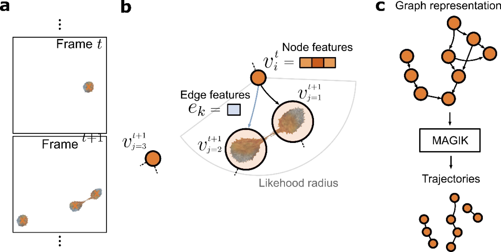

# MAGIK - A Geometric Deep Learning Framework

## Introduction
MAGIK is a geometric deep-learning framework for analyzing biological system dynamics from time-lapse microscopy. It models object movement and interactions through a directed graph, where nodes represent object detections at specific times, and edges connect nodes that are spatiotemporally close. The framework aims to prune redundant edges while retaining true connections using a Message Passing Neural Network.


*MAGIK Framework: Relations among cells detected over consecutive frames (a) are modelled geometrically using a directed graph (b), where  nodes, **v**, represent detections and edges, **e**, connect spatiotemporally close objects. MAGIK process the graph (c) predicting connection probabilities between objects as a binary edge-classification task.*


## Features
- Graph-based representation of object trajectories
- Flexible feature encoding for nodes and edges
- Edge classification for trajectory reconstruction
- Postprocessing algorithm to refine connections

## Tutorial
A Python Notebook is provided for executing all the steps for applying MAGIK on 2D datasets from the Cell Tracking Challenge. The notebook is divided into five main sections:
1. **Reading and Viewing the Data** - Download and visualize datasets.
2. **Graph Construction** - Build a directed spatiotemporal graph from segmentation maps.
3. **Dataset Construction** - Generate training data using stochastic sampling.
4. **MAGIK Definition and Training** - Define and train MAGIK using the deeplay deep learning package.
5. **Model Evaluation** - Assess prediction quality and visualize trajectories.

## Reproducing Benchmark Results
For reproducing the results of the Cell Linking Benchmark, one can either execute the .sh files in the SW folder, or run the my_linker.py file as follow:
```
python ./my_linker.py "../Fluo-N2DL-HeLa/02" "../Fluo-N2DL-HeLa/02_ERR_SEG" "../Fluo-N2DL-HeLa/02_RES"
```
changing the dataset name and sequence number.

## References
Pineda, J., Midtvedt, B., Bachimanchi, H., Noé, S., Midtvedt, D., Volpe, G., & Manzo, C. (2023). Geometric deep learning reveals the spatiotemporal features of microscopic motion. *Nature Machine Intelligence, 5*, 71-82.

## BibTeX
```bibtex
@article{pineda2023geometric,
  author = {Pineda, J. and Midtvedt, B. and Bachimanchi, H. and Noé, S. and Midtvedt, D. and Volpe, G. and Manzo, C.},
  title = {Geometric deep learning reveals the spatiotemporal features of microscopic motion},
  journal = {Nature Machine Intelligence},
  volume = {5},
  pages = {71-82},
  year = {2023}
}
```
